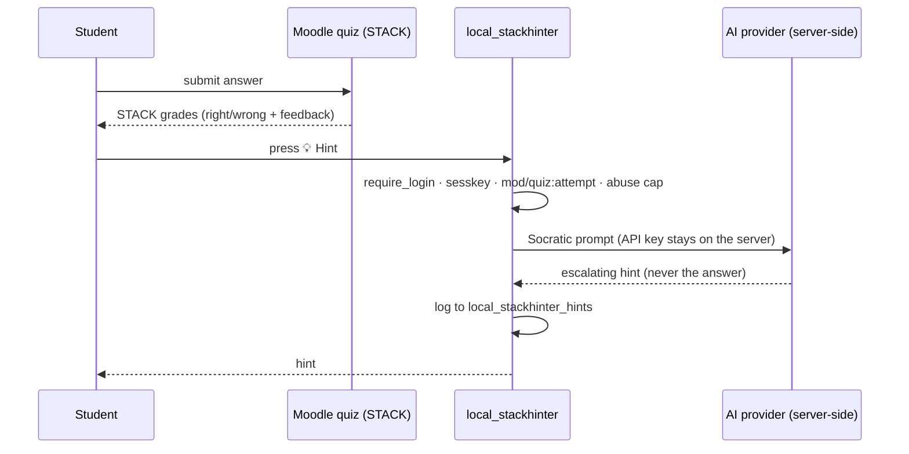

# STACK AI Hinter (local_stackhinter)

A Moodle **local plugin** that adds patient, escalating **Socratic hints** to
[STACK](https://stack-assessment.org/) quiz-attempt pages. When a student is stuck, they press
**💡 Hint** and get a short nudge about *their* specific mistake — **never** the final answer. The AI
provider's API key lives **server-side**; the browser only ever calls this plugin's own endpoint.

## Requirements

- **Moodle 4.5 LTS** or later (developed and tested on 4.5; uses the Hooks API).
- The **STACK question type** (`qtype_stack`) — the hinter targets STACK questions and declares
  `qtype_stack` as a dependency.
- An **AI backend**: either Moodle's built-in **core AI** (configure a provider under *Site
  administration → AI* — no separate key needed) **or** this plugin's own API key for one external
  provider (OpenAI, Anthropic Claude, Google Gemini, AWS Bedrock, OpenRouter, Groq, Mistral, Cerebras,
  or an OpenAI-compatible gateway). AWS Bedrock additionally takes an AWS region.

## Install

### From the Moodle Plugins directory (recommended once published)
Site administration → Plugins → Install plugins → search for *STACK AI Hinter*.

### Manually
Copy this directory to `<moodleroot>/local/stackhinter` (the folder **must** be named `stackhinter`), then
visit *Site administration → Notifications*, or run `php admin/cli/upgrade.php --non-interactive`.

## Quick start: free AI in about 2 minutes

The plugin ships **inert** (disabled, with no key). Two no-cost ways to make it work:

**Option A: a free API key (fastest for a single site).**
1. Create a free key at [openrouter.ai/keys](https://openrouter.ai/keys), or use Google's [Gemini free tier](https://aistudio.google.com/apikey).
2. In *Site administration → Plugins → Local plugins → STACK AI Hinter*, set **AI provider** to **OpenRouter**, paste the key into **AI API key**, and set **Model** to a current model id ending in `:free` from the [free models list](https://openrouter.ai/models?max_price=0) (for example `meta-llama/llama-3.3-70b-instruct:free`). With Gemini instead, use provider **Google Gemini** and model `gemini-2.5-flash`.
3. Tick **Enable STACK AI Hinter**, then turn hints on for a quiz in its *Settings → STACK AI Hinter*.

**Option B: reuse Moodle's built-in AI (no separate key).** If an administrator has configured an AI provider under *Site administration → AI*, leave **AI backend** on **Auto**: the hinter uses Moodle's core AI, inheriting its AI policy and logging. This is the cleanest path for an institution that already runs AI centrally.

> Per hint, only the question text, the student's current answer, the grader feedback and a one-word CAS diagnosis are sent; the model answer is never sent. Pick a provider whose data-handling terms suit your institution.

## Configure

*Site administration → Plugins → Local plugins → STACK AI Hinter*. The plugin is **disabled by default**
and does nothing until you:

| Setting | Description |
|---|---|
| **Enable STACK AI Hinter** | Site master switch (off by default). When on, teachers turn hints on **per quiz** (off by default) in each quiz's settings — so they never appear on a quiz nobody opted in, including exams. |
| **AI backend** | Moodle's built-in core AI, this plugin's own provider/key, or *Auto* (prefers core when available). |
| **AI provider** | Which external service generates hints (used by the own-provider backend). |
| **Model** | The model id, e.g. `gpt-4o-mini`, `gemini-2.5-flash`, `claude-3-5-haiku`. |
| **AI API key** | Stored server-side, never sent to the browser. |

**Per quiz** (in each quiz's *Settings → STACK AI Hinter*): a teacher enables hints on that quiz (off by
default) and sets the **max hints per question** for it (a separate hard server cap also prevents abuse).

## How it works

- A footer hook loads the `local_stackhinter/hinter` AMD module **only** on quiz-attempt pages of quizzes a
  teacher has enabled hints on (off by default), and the module attaches to STACK questions. The
  per-quiz opt-in is also enforced server-side on every endpoint.
- The module adds a hint button to each STACK question, reads the student's current answer + grader
  feedback from the DOM, and posts them to `ajax.php`.
- `ajax.php` re-checks `mod/quiz:attempt`, enforces an abuse cap, calls the AI **server-side**, logs
  the hint, and returns it. The Socratic system prompt forbids revealing the answer.

### CAS-grounded hints (the oracle, not the LLM, does the maths)

LLMs are unreliable at symbolic maths, so the hinter never asks the AI to judge correctness. Instead,
for a STACK question it asks **Moodle's own STACK / Maxima** to classify how the student's current
answer relates to a correct one, and gives the AI only that qualitative class:

- **equivalent** — algebraically correct but in the wrong *form* (e.g. not expanded/factored);
- **constant** — off by a constant term;
- **structural** — a term involving the variable is wrong, missing or extra.

Only the class is sent to the AI. The model answer and the exact difference are computed server-side
and never leave it, so the hint stays accurate **and** cannot leak the answer. If grounding is not
available (non-STACK or multi-input question, an invalid answer, or any CAS error) the hinter falls
back to hinting from the question text and grader feedback alone. The student value enters the CAS only
through STACK's own validated-input path, and the question usage is verified to belong to the student's
own attempt first.

## Privacy

This plugin **stores** a per-user hint log (`local_stackhinter_hints`) and **discloses** the question
text, the student's answer, the grader feedback, and (for STACK questions) a short qualitative
diagnosis of the answer to the configured AI backend in order to generate a hint. When the backend is
Moodle's built-in core AI, the request is handled by Moodle's core AI subsystem, which governs that
disclosure. The model answer and exact CAS values are never sent. All of this is declared via the
Moodle Privacy API (`classes/privacy/`), including full export and deletion support. Choose a provider
whose data-handling terms suit your institution.

## Security

- Disabled by default; no external call until fully configured.
- Server-side key only; capability-gated (`mod/quiz:attempt`) with sesskey; per-user/per-quiz hint cap.
- Per-quiz opt-in is enforced server-side on every endpoint, so hints cannot be used on a quiz that
  did not enable them.

## For reviewers / maintainers

- To exercise hints, set a provider + model + key, enable hints on a quiz, and attempt that STACK quiz.
- `amd/build/hinter.min.js` is generated from `amd/src/hinter.js` by Moodle's `grunt amd`. After editing
  the source, rebuild with `grunt amd` from a Moodle checkout so the committed build stays canonical
  (this is what `moodle-plugin-ci grunt` verifies).

## License

[GNU GPL v3 or later](LICENSE) — the same license as Moodle.
